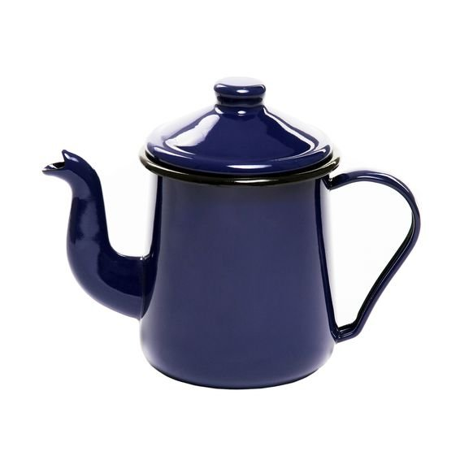

# Owl Rules

A rule engine processor with an expression boolean language to define the rules.

## How to use

    val result = RulesEngine().check("platform = 'android'", mapOf("platform" to "android"))
    
The first parameter is the rule and the second is a Map<String, Any> that contains de variables used to evaluate the rule.

## Bule Language

Bule is the name of the programming language used to write the rules, it's just boolean expressions. 
The result of a Bule expression is always `true` or `false`. See some examples of valid Bule expressions:

| Expression | Result | Description |
| --- | --- | --- |
| true | true | Literal true |
| false | false | Literal false |
| 1 = 1 | true | Number equality |
| 1 = 2 | false | Number equality |
| 1 > 3 | false | Number is greater than other number |
| 1 >= 3 | false | Number is greater than or equals other number |
| 1 < 3 | true | Number is less than other number |
| 1 <= 3 | false | Number is less than or equals other number |
| 'john' = 'owl' | false | Text equality |
| [1 2 3 4] CONTAINS 4 | true | Check if a number list contains a number |
| ['blue' 'yellow' 'green'] CONTAINS 'pink' | false | Check if a text list contains a text |
| [1 2 3 4] NOT CONTAINS 4] | false | Check if a number list does not contain a number |
| Number(version) >= 12] | false | Check if a variable named version converted to Number is greater than or equals the number 12 |
| (1 > 2) OR (1 = 1)| true | Return true if one of the expressions is true |
| (3 > 2) AND (1 = 1)| true | Return true if all of the expressions are true |
| NOT (1 = 1)| false | Return true if the result is false and false if the result is true |

### Data Types

- **Number**: it's an integer positive number like `12`, `56`, `0`, `99`.
- **Text**: it's something inside `'` and `'`, like `'John'`, `'12'`, `'Lorem ipsum'`.
- **List**: it's a group of Number or Text values, some valid lists are: `[1 2 3 4]`, `['blue' 'green' 'yellow']`

### Variables

**Every variable in Bule is text**, if you want to use a variable as a Number or a List you must convert it 
using `Number(variableName)` for a number or `List(variableName)` for a list.

### Complex expressions

**You always have to use parentheses in complex expressions** with AND, OR, NOT to avoid inconsistencies. Examples:

- `(NOT (1 > 3)) AND (2 > 3) OR (3 > 2)`
- `((3 > 2) AND (2 > 4) AND (4 > 3)) OR (1 = 1)`
